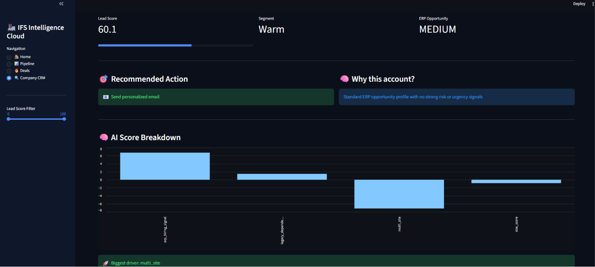

# 🚀 IFS Intelligence Cloud
### 🤖 AI Sales Copilot for ERP Lead Scoring & Explainability

<p align="center">
  
</p>

<p align="center">
  <b>An intelligent sales platform that scores leads, explains why, and generates outreach — all powered by AI.</b>
</p>

<p align="center">
  
  
  
  
</p>
---

## 🧠 What is this?

IFS Intelligence Cloud is an **AI-powered sales copilot** designed to help ERP sales teams:

- 🎯 Identify high-value companies  
- 📊 Score ERP opportunity using machine learning  
- 💡 Understand why a lead matters (Explainable AI)    
- 📞 Take the right sales action  
- 📧 Generate personalized outreach using GPT  

---

## ✨ Key Features

### 🎯 Lead Scoring (ML)
- Predicts ERP opportunity score (0–100)
- Based on:
  - Company size  
  - Multi-site structure  
  - Legacy systems  
  - Hiring signals  

---

## 🧠 Explainable AI

Powered by **SHAP (SHapley Additive Explanations)**

For each company, the system:

- Breaks down the score into feature-level contributions  
- Shows what increases or decreases the score  
- Identifies the **biggest driver behind the opportunity**  

✅ Example insights:
- Legacy system dependency strongly drives ERP adoption  
- Multi-site operations increase complexity → higher need  
- Hiring signals indicate transformation readiness  

👉 This transforms the model from a **black box → transparent decision system**

---

### ⚡ Action Engine
Automatically suggests next steps:

| Score | Action |
|------|--------|
| 85+ | 📞 Call immediately |
| 70–84 | 📅 Schedule demo |
| 50–69 | 📧 Send email |
| 30–49 | 📨 Nurture |
| <30 | ❌ Ignore |

---

###  💬 Sales Intelligence Layer

For every company, the system provides:

- ✅ Recommended Action  
- ✅ Why this lead? (AI reasoning)  
- ✅ Sales Playbook (how to approach)  
- ✅ Intelligence Summary  

---

### 📧 GPT-Powered Email Generation

Generate personalized outreach emails in one click:

The system uses **OpenAI GPT** to create:

- Personalized outreach emails  
- Context-aware messaging  
- Natural human tone  

---

## 🖥️ CRM Experience

A full **SaaS-style dashboard** built with Streamlit:

- 📊 Pipeline view (lead scoring table) 
- 🔥 Deals view (top opportunities)  
- 🔍 Company CRM panel with AI insights 
- 🤖 AI email generator 

---

## ⚙️ How It Works

```
Synthetic Data 
   ↓
Feature Engineering
   ↓
ML Model → Scoring
   ↓
AI Insight + Action Layer
   ↓
GPT (Email Generation)
```

## 🏗️ Project Structure

```bash
├── app/
│   └── streamlit_app.py
├── pipeline/
│   └── train_pipeline.py
├── src/
│   ├── data_generator.py
│   ├── features.py
│   ├── train.py
│   ├── predict.py
│   └── explain.py
├── models/
├── outputs/
├── .streamlit/
│   ├── config.toml
│   └── secrets.toml
├── requirements.txt
└── README.md

```

## 🚀 Getting Started

1. Install dependencies

```bash
pip install -r requirements.txt
```


2. Run pipeline

```bash
python pipeline/train_pipeline.py
```


3. Add OpenAI API Key

Create:

```bash
.streamlit/secrets.toml
```

Add:

```toml
OPENAI_API_KEY="your_api_key_here"
```

4. Launch app

```bash
streamlit run app/streamlit_app.py
```


## 🧪 Tech Stack

- Python  
- Pandas / NumPy  
- Scikit-learn  
- Streamlit  
- OpenAI API (GPT)  


## 💼 Business Value

- 🚀 Focus on high-quality leads  
- ⏱️ Save sales time  
- 📈 Increase conversion rates  
- 🤖 Automate outreach  
- 📊 Enable data-driven decisions  


## 🎯 One-Line Summary
An AI-powered sales copilot that scores leads, recommends actions, and generates personalized outreach using machine learning and GPT.

## 🌐 Deployment

You can deploy this app using:

- Streamlit Cloud
- Hugging Face Spaces
- Docker (optional)

---

## ⚠️ Notes

- Synthetic dataset used (no real company data)
- API key required for GPT features


## 👤 Author
Gizem Şentürk

---

## ⭐ Support

If you found this project useful:

- ⭐ Star this repository  
- 🔗 Share on LinkedIn  
- 💬 Connect with me: [LinkedIn](https://linkedin.com/in/senturkgizem91)